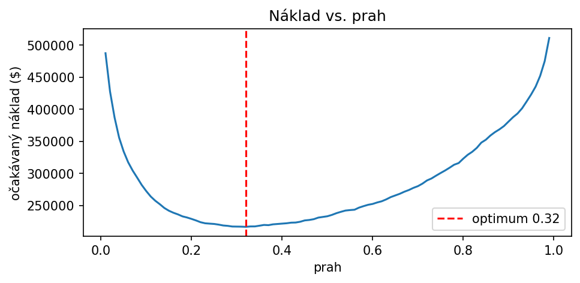
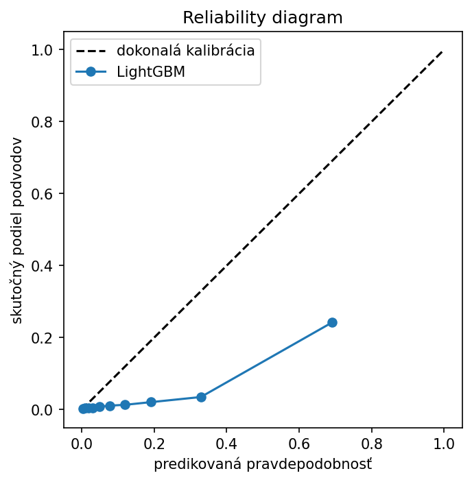
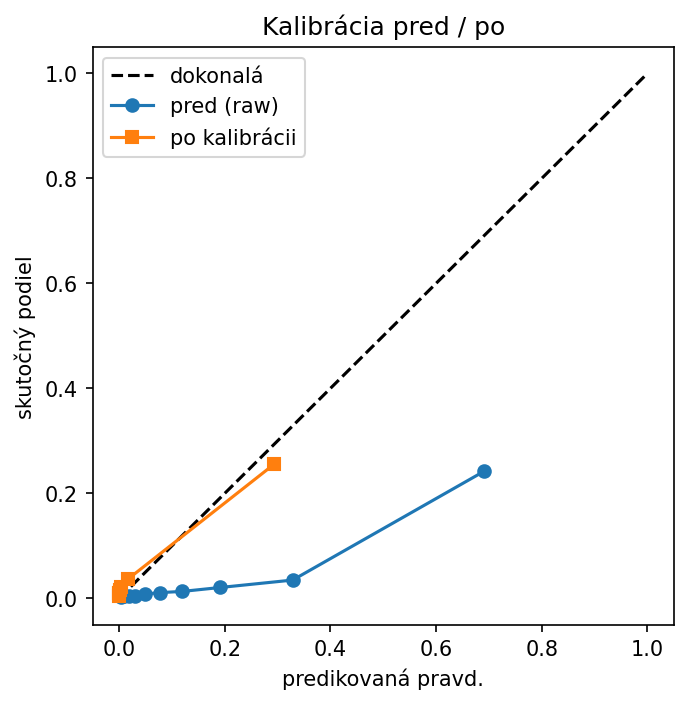
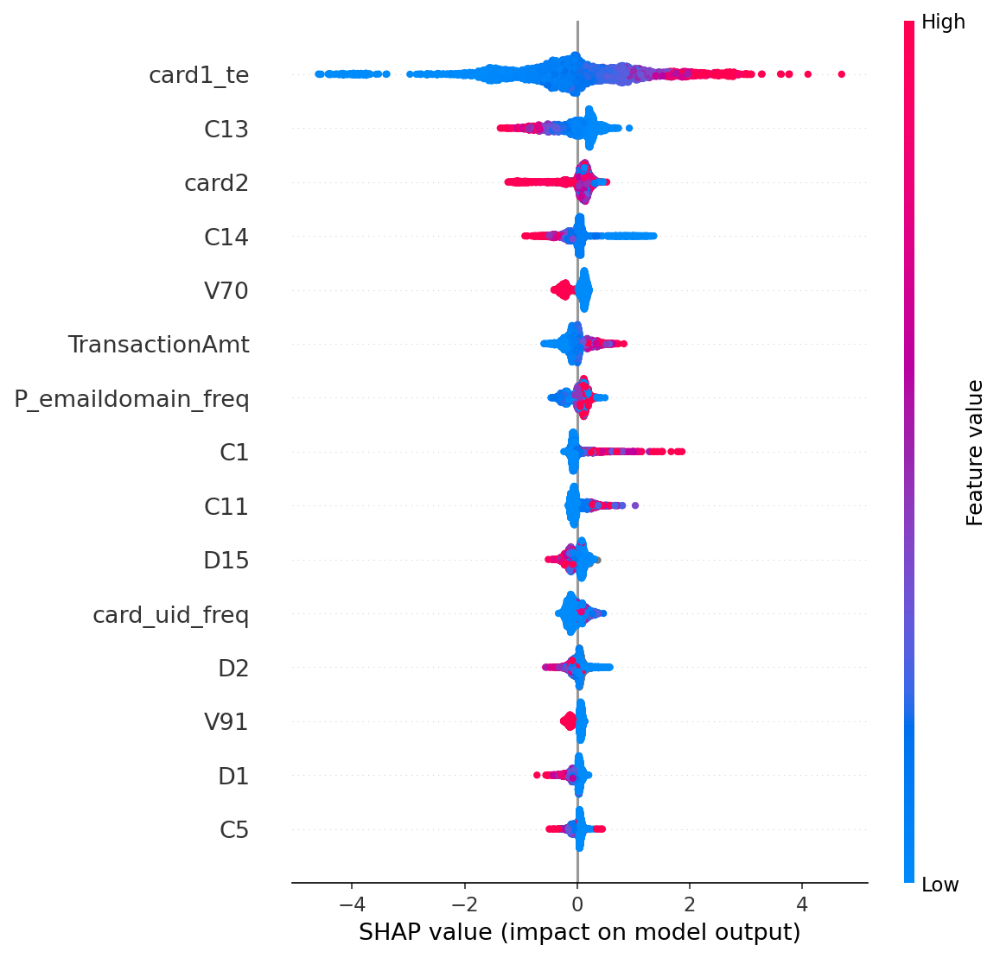

# Fraud detection on IEEE-CIS

An end-to-end fraud classifier on the IEEE-CIS dataset, built around the parts
that decide whether a model is actually usable rather than just good on a
leaderboard: a time-based split, leakage-safe encoding, evaluation in cost
terms, and probability calibration with SHAP explanations.

Headline result: reviewing the **top 10% of transactions by model score catches
70% of all fraud** (and 67% of the fraud value), a **7× lift** over reviewing a
random 10%. Choosing the decision threshold by cost instead of the default 0.5
raises recall from 68% to 77% and cuts expected cost by ~$16,500 on the test
window.

## Data

IEEE-CIS Fraud Detection (Kaggle, 2019; data provided by Vesta Corporation).
~590k card-not-present e-commerce transactions over roughly six months, ~3.5%
labelled fraud. Features are anonymised (`V*`, `C*`, `card*`, `id_*`) and
`TransactionDT` is a seconds offset rather than a real timestamp, which is enough
to order the data in time.

The data is not included in this repo - the competition licence doesn't allow
redistribution. Download `train_transaction.csv` and `train_identity.csv` from
the [competition page](https://www.kaggle.com/c/ieee-fraud-detection) to run it.

## Problem framing

The score supports a decision: approve, send to manual review, or decline. The
two errors don't cost the same. A missed fraud (false negative) costs roughly
the transaction value; a false alarm (false positive) costs a manual review plus
some customer friction. That asymmetry is the reason the threshold isn't left at
0.5.

## Approach

**Time-based split.** The last 20% of time is the test set (days 141–182),
the rest is train (days 1–141). No shuffling. The average fraud rate is stable
across the split (3.51% vs 3.44%), but the split still matters: in production you
always predict forward, and the feature patterns that flag fraud drift over the
six months even when the average doesn't. A random split would produce nicer but
misleading numbers.

**Leakage-safe features.** Per-row features (log amount, hour, missing-value
count) are safe. Anything that learns from the data - frequency and target
encoding - is fit on train only and mapped onto test. Target encoding is where
this bites: computing card risk over the whole dataset gives a single feature an
AUC of 0.84 because each row sees its own label. Fit correctly (train only, with
smoothing) the same feature scores 0.83 on train and 0.75 on test. That
train–test gap is exactly what the leaked version hides.

**Models.** A logistic-regression baseline on the engineered features, then
LightGBM on all numeric columns with `scale_pos_weight` for the imbalance.
Keeping the baseline makes the gain from the stronger model explicit rather than
assumed.

**Evaluation in cost terms.** A gains/lift table (how much fraud is caught at
each review budget) and a cost curve that picks the threshold minimising expected
cost from the FN/FP cost matrix.

**Calibration and explainability.** A reliability diagram, isotonic calibration
so the outputs are real probabilities, and SHAP to show what drives the score.

## Results

Scored on the time-based test set (118,108 transactions):

| Model | PR-AUC | ROC-AUC | Features |
|---|---|---|---|
| Logistic regression (baseline) | 0.140 | 0.781 | 11 |
| LightGBM | 0.529 | 0.893 | 411 |

Against a 0.035 base rate, PR-AUC of 0.53 is a ~15× improvement. Worth noting
that ROC-AUC barely separates the two models (0.78 vs 0.89) while PR-AUC nearly
quadruples - with 96.5% negatives, ROC-AUC flatters the model, so PR-AUC is the
metric I trust here. The baseline also only gets the 11 engineered features
against LightGBM's 410, so part of the gap is data and part is the model.

**Operational view (LightGBM):**

| Review budget | Fraud caught | Fraud $ caught | Lift |
|---|---|---|---|
| Top 10% | 70.3% | 66.9% | 7.0× |
| Top 20% | 80.4% | 79.2% | 4.0× |
| Top 30% | 86.4% | 86.6% | 2.9× |

**Threshold by cost** (FN = \$150, FP = \$5): the optimum is 0.32, not 0.5. It
flags 15% of transactions for review, catches 77% of fraud, and costs \$216,500
on the test window versus \$233,025 at the default 0.5 - the same model, ~$16,500
saved by moving one number.

**Calibration:** `scale_pos_weight` inflated probabilities (mean predicted 0.15
vs an actual 0.034). Isotonic calibration pulls the mean back to ~0.03 with
PR-AUC essentially unchanged (0.529 → 0.520), so ranking is preserved while the
probabilities become usable for expected-loss decisions.

**Drivers (SHAP):** the strongest feature is the target-encoded card risk
(`card1_te`), in the expected direction, and two other hand-built features
(email frequency, card-uid frequency) land in the top 15 of ~410. Most remaining
drivers are anonymised `V`/`C` columns, so the direction is clear but not the
business meaning.







## Limitations

- Features are anonymised, so SHAP shows which columns matter but not why in
  domain terms. On real in-house data the same output would be directly
  interpretable.
- The cost matrix (\$150 / \$5) is an assumption for illustration, not a measured
  figure. The method is the point; the exact numbers would come from the business.
- The cost threshold was fit on the raw scores. For real use it should be
  recomputed on the calibrated probabilities.
- Median card history is ~2 transactions, so behavioural per-card aggregates
  (spend deviation, time since last transaction) weren't worth building here.

## Next steps

Out-of-fold target encoding inside a time-series CV to shrink the train–test gap
further, and per-card behavioural features if longer histories were available.

## Reproduce

```bash
pip install -r requirements.txt
# download train_transaction.csv and train_identity.csv from Kaggle into the data folder
# then run the notebook top to bottom
```

